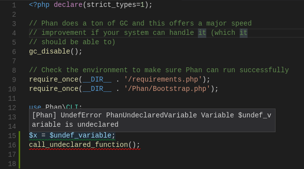

# Phan for Visual Studio Code

Based on [PHP IntelliSense](https://github.com/felixfbecker/vscode-php-intellisense)

This adds error detection from phan to Visual Studio Code.

**Note: This is just the VS Code extension that spawns Phan. Phan is implemented purely in PHP [in its own repository](https://github.com/phan/phan), all features need to be implemented there and all issues should be reported there.**

## Installation

### Dependencies:

1. PHP 7.1+ must be installed.
   You can either add it to your PATH or set the `phan.executablePath` setting.
2. Unix/Linux (Depends on `pcntl` module being installed, which is only available on those platforms)
3. [The `php-ast` PECL extension](https://pecl.php.net/package/ast) must be installed and enabled.
4. Depends on using a checkout of Phan with https://github.com/phan/phan/pull/1144 installed


### Installing from source

This extension hasn't been published yet. It can be installed locally with the following method:

```bash
npm install
npm run build
node node_modules/.bin/vsce package
```

The generated VSIX file can be used locally with the steps from https://stackoverflow.com/a/38866913

### Setup steps

This assumes you have already installed the [dependencies](#dependencies).

Add these entries to your VSCode config (Open the menu at File > Preferences > Settings)


```
{
    // Currently, this extension is limited to analyzing only a single folder.
    // The config value must be the root of the project, and contain a .phan/config.php file with a Phan config for that project (including files to parse and analyze).
    "phan.analyzedProjectDirectory": "/path/to/folder/to/analyze",

    // Path to a php 7.1 binary with the php-ast PECL extension installed and enabled
    "phan.phpExecutablePath": "/path/to/php7.1",

    // Path to the phan executable
    "phan.phanScriptPath": "/path/to/vendor/phan/phan/phan",

    // Files which this should analyze
    "phan.analyzedFileExtensions": ["php"]
}
```

## Features

### Error Detection


## Contributing

Clone whole repository and in root directory execute:

```bash
composer install
npm install
npm run build
code .
```

The last command will open the folder in VS Code. Hit `F5` to launch an Extension Development Host with the extension.
For working on the language server, the easiest way is to replace the language server installation from composer in `vendor/felixfbecker/language-server` with a symlink to your local clone.

**For guidance on how to set up a Phan project, please see [phan/phan](https://github.com/phan/phan).**

## Source

[github.com/TysonAndre/vscode-php-phan](https://github.com/TysonAndre/vscode-php-phan)
